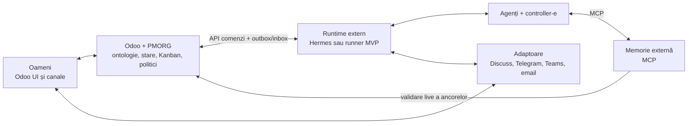
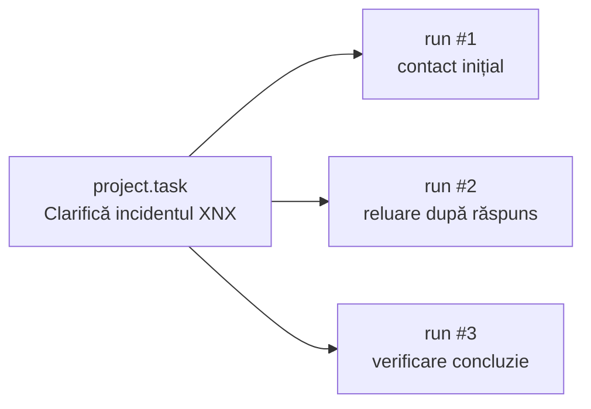

# PMORG v2 — arhitectura țintă

| Câmp | Valoare |
|---|---|
| Status | Propunere canonică pentru revizuire |
| Versiune | 0.3 |
| Data | 2026-07-16 |
| Baseline MVP | Odoo 19 Community |
| Revizie Odoo | `1b8f6802832cfa4d146193a912af1f4445d09f0a` |

> **Statut: definiție de proiect, nu descrierea implementării curente.**
>
> În snapshotul actual, Kanbanul Hermes, integrarea Odoo și `aipm` există ca
> piese separate. Aplicația Odoo și garanțiile descrise aici trebuie
> implementate și validate. Verbele la prezent exprimă cerințe ale țintei,
> nu funcționalități deja livrate.

## 1. Decizia centrală

PMORG este o **aplicație Odoo** care face vizibil și guvernează un operator
organizațional persistent.

- **Odoo** este ontologia executabilă și registrul formal al organizației.
- **Nucleul PMORG** este agnostic față de organizația concretă; diferențele
  apar prin module, anchor packs, permisiuni și politici configurate.
- **`project.task` extins** este registrul canonic al muncii umane, agentice și
  hibride cu semnificație organizațională.
- **Hermes** este prima implementare vizată a runtime-ului extern de
  orchestrare și agenți, dar poate fi înlocuit prin contract.
- **Memoria organizațională** este un serviciu extern accesat prin MCP. Odoo
  păstrează doar starea formală și referințele necesare.
- **Canalele** sunt adaptoare înlocuibile; transportul nu deține conversația.
- **Longitudinalitatea** rezultă din stare persistentă, controller-e
  reexecutabile și operații idempotente, nu dintr-o sesiune LLM permanentă.

În MVP, un runner determinist poate conduce aceleași contracte în locul
Hermes. Odoo și memoria sunt implementări reale, nu mock-uri.

## 2. Limitele și proprietatea stării



| Domeniu | Proprietar canonic | Nu deține |
|---|---|---|
| Entități și stare business | Odoo și modulele active | transcript, embeddings |
| Inițiativă, plan aprobat, rezultat | PMORG în Odoo | raționament liber |
| Muncă organizațională | `project.task` extins | micro-pașii runtime-ului |
| Execuție agentică | `pmorg.task.run` | memoria conversației |
| Urmărire longitudinală | stare PMORG în Odoo, operată de controller-e | sesiune LLM persistentă |
| Evidențe, claims, proveniență, istorie | memoria externă | starea business duplicată |
| Transportul mesajelor | adaptorul de canal | sensul organizațional |
| Judecată contextuală | agent invocat episodic | autoritate sau stare canonică |

Regula de consistență:

> Odoo spune **ce este formal adevărat acum**; memoria spune **ce s-a spus,
> de ce credem ceva și cum s-a schimbat**; runtime-ul decide **ce încearcă în
> continuare**, în limitele politicilor.

Runtime-ul, agenții și memoria rulează în afara worker-elor Odoo. Apelurile
LLM nu rulează în tranzacțiile utilizatorilor.

### 2.1 Frontiera de evaluare nu este parte din produs

Oracle-ul, worldgen, personas, corpusul și scorerul există numai în
[sandboxul complet](06-EVALUATION-SANDBOX.md). Ele nu intră în topologia de
producție și nu devin surse de adevăr business. În test, PMORG vede numai
fixture-ul public materializat în Odoo, mesajele efectiv livrate și propria
memorie; adevărul privat și expected outputs sunt inaccesibile.

Manifestul fiecărui run declară `sut_scope`. La Gate C–D runnerul determinist
este harness de referință pentru Odoo + memorie; la Gate E agentul/modelul
intră în SUT; Gate F1 adaugă Hermes/adaptorul cu agent determinist, iar F2
evaluează integrarea Hermes + operatorul AI înghețat la E. Astfel un driver
scriptat nu este confundat cu inteligența produsului și nici runtime-ul nu
este calificat separat de operatorul final.

## 3. Aplicația PMORG în Odoo

Pentru utilizator există o singură aplicație. Tehnic, ea poate fi o suită:

```text
pmorg_core                         # base + project
pmorg_orchestrator_api
pmorg_memory_bridge
pmorg_anchor_hr / inventory / time_off / sales / accounting / ...
```

Numele API-ului nu trebuie legat de Hermes; adaptorul Hermes este un client.
`pmorg_core` depinde numai de `base` și `project` și nu declară câmpuri către
modele de domeniu opționale. Un addon de ancorare depinde de nucleu și de
modulul Odoo pe care îl descrie. Instalarea sau absența lui este configurare,
nu variantă de cod a produsului.

```text
pmorg_anchor_hr        -> pmorg_core + hr
pmorg_anchor_inventory -> pmorg_core + stock
pmorg_anchor_time_off  -> pmorg_core + hr_holidays
```

Registry-ul încarcă numai pack-urile ale căror dependențe și fingerprint-uri
sunt valide. UI-ul și API-ul nucleului rămân funcționale în profilul
`project`-only.

Modelele necesare ca responsabilitate sunt:

| Model | Rol |
|---|---|
| `pmorg.identity` | identitatea canonică a ownerilor, validatorilor, participanților și agenților |
| `pmorg.initiative` | unitatea longitudinală, de la intenție la rezultat |
| `pmorg.objective`, `pmorg.success.criterion` | obiectiv și condiții verificabile |
| `pmorg.plan.version` | plan versionat, fără suprascrierea istoriei |
| `project.task` extins | unitatea canonică de muncă |
| `pmorg.task.run`, `pmorg.task.event` | încercări tehnice și jurnal de tranziții |
| `pmorg.commitment` | promisiune confirmată, cu autor și termen |
| `pmorg.intervention`, `pmorg.escalation` | follow-up și escaladare formală |
| `pmorg.outcome`, `pmorg.evidence.reference` | rezultat și dovadă |
| `pmorg.anchor`, `pmorg.memory.reference` | legături spre Odoo și memorie |
| `pmorg.monitoring.policy`, `pmorg.autonomy.policy` | longitudinalitate și autoritate |
| `pmorg.outbox.event`, `pmorg.command.inbox` | integrare durabilă și deduplicare |

Odoo nu stochează fiecare mesaj, token, tool call sau sub-raționament. Păstrează
ce este necesar pentru control, audit și reconstrucția stării formale.

### 3.1 Vocabular normativ inițial

Etichetele din UI pot fi traduse, dar valorile tehnice inițiale sunt unice:

```text
initiative_state:
  draft | clarifying | planned | awaiting_confirmation | active |
  verifying | closed | cancelled

execution_mode:
  human | agent | hybrid | monitor

identity_kind:
  human | agent | system

pmorg_task_type:
  execution | clarification | investigation | planning | followup |
  confirmation | monitoring | escalation | verification

autonomy_level:
  read | recommend | execute_delegated | approval_required | prohibited
```

`at_risk`, `blocked`, `paused` și `degraded` sunt condiții operaționale
explicite; proiectarea schemei decide dacă devin state, health flags sau
obiecte asociate, fără a le confunda cu dispariția inițiativei.

### 3.2 Identitatea canonică

Nucleul nu folosește alternativ `res.users`, `res.partner` sau
`hr.employee`. Toate rolurile PMORG referă `pmorg.identity`, cu minimul:

```text
company_id
partner_id             # obligatoriu
user_id                # opțional; contul care poate acționa în Odoo
identity_kind          # human | agent | system
active
```

Perechea `(company_id, partner_id)` este unică. Dacă există `user_id`,
`user_id.partner_id` trebuie să fie același `partner_id`. Ownerul,
validatorul și participanții sunt `pmorg.identity`; autorizarea unei comenzi
folosește utilizatorul legat sau o delegare explicită, nu simpla existență a
identității.

`pmorg_anchor_hr` leagă `hr.employee` de identitatea existentă prin
`user_id` sau `work_contact_id`. Nu creează o a doua persoană. Dacă legătura
este absentă sau ambiguă, pack-ul cere mapare explicită și se oprește
fail-closed pentru acea identitate. Ierarhia HR poate informa politica, dar
ownerul inițiativei, project managerul și delegările explicite rămân
disponibile când HR nu există.

## 4. `project.task` canonic și operabil de Hermes

`project.task` reprezintă și taskuri care nu provin nativ dintr-un modul Odoo:

> „Discută cu gestionarul pentru clarificarea incidentului XNX.”

Acesta este un exemplu al profilului distribuție, nu un concept al nucleului.
În servicii, aceeași structură poate reprezenta „Clarifică noul termen al
livrabilului”, iar în profilul minimal „Obține criteriul de acceptare lipsă”.

Extensia PMORG îi dă semantică organizațională:

```text
pmorg_task_type:
  execution | clarification | investigation | planning | followup |
  confirmation | monitoring | escalation | verification

execution_mode:
  human | agent | hybrid | monitor

agent_profile_id
participant_anchor_ids
subject_anchor_ids
expected_outcome
completion_criteria
monitoring_policy_id
next_check_at
awaiting_response_from / awaiting_since
last_progress_at / last_intervention_at
followup_count / escalation_level
verification_status
active_run_id / state_version
```

Numele câmpurilor poate fi ajustat în schema tehnică; responsabilitățile nu.

### 4.1 Două stări distincte

Stage-ul Odoo este configurabil și exprimă starea business, de exemplu:

```text
Nou → În lucru → În verificare → Finalizat
```

Separat, `pmorg_orchestration_state` are o semantică stabilă:

```text
not_managed | ready | claimed | running | waiting_response |
waiting_approval | scheduled | blocked | review | failed |
completed | cancelled
```

- Execuția `completed` nu închide automat taskul business.
- Taskul poate fi „În lucru” și orchestrarea `waiting_response`.
- Închiderea cere criterii și, dacă politica o impune, rezultat verificat.
- O schimbare manuală a stage-ului produce eveniment și reconciliere; nu
  anulează sau suprascrie în tăcere un claim activ.

### 4.2 Task versus run



Micro-pașii efemeri rămân în runtime. Numai încercările necesare pentru
control, retry și audit devin `pmorg.task.run`.

## 5. Claim, lease și idempotency

Agenții nu revendică un task prin `search` urmat de `write`. Odoo expune
metode server-side atomice.

Un task poate fi revendicat numai dacă este scadent/eligibil, dependențele îi
permit execuția, capabilitățile și compania corespund, politica permite
acțiunea și nu există lease valid concurent.

Claim-ul scrie într-o singură tranzacție:

- run-ul activ și identitatea runtime/agent;
- tokenul opac și expirarea lease-ului;
- versiunea stării;
- evenimentul outbox.

Garanții obligatorii:

- fiecare comandă are `idempotency_key` unic în scope-ul sursei;
- retry-ul aceleiași comenzi întoarce același rezultat;
- mutațiile folosesc `expected_version` sau token de lease;
- heartbeat-ul poate extinde numai lease-ul ownerului curent;
- un watchdog determinist recuperează lease-urile expirate;
- un rezultat tardiv este respins sau trimis în review;
- idempotency pentru mesaj, task și completare este separată.

## 6. Ontologia și anchor packs

Odoo este o ontologie executabilă: modelele au identitate, relații, stări,
reguli și autoritate.

> Modulele instalate delimitează vocabularul posibil. PMORG activează din ele
> numai entitățile business de prim nivel definite în pachete semantice
> versionate.

O entitate de prim nivel are identitate și ciclu de viață business și poate fi
subiect, participant, responsabil, constrângere sau rezultat. Modelele tehnice,
liniile și configurările interne nu sunt promovate automat.

| Modul | Exemple de entități posibile |
|---|---|
| Project | proiect, task, milestone, dependență |
| Employees | angajat, departament, funcție |
| Time Off | cerere, tip de concediu, alocare, aprobare |
| Sales | client, ofertă, comandă |
| Inventory | produs, depozit, transfer, mișcare, lot relevant |
| Accounting | factură, plată, scadență |

Discovery-ul determinist citește module, versiuni, `ir.model`, câmpuri,
relații, selecții, moșteniri, customizări, ACL-uri și un fingerprint de
schemă. Semantica este definită într-un anchor pack:

```yaml
capability: time_off
requires:
  module: hr_holidays
entities:
  LEAVE_REQUEST:
    model: hr.leave
    fields:
      employee: employee_id
      type: holiday_status_id
      start: date_from
      end: date_to
      status: state
    authority_policy: time_off_approver
```

Pentru Gate C2, `pmorg_anchor_inventory` are un subset minim fixat pe sursa
oficială Odoo 19:

| Tip ancoră | Model | Câmpuri live minime | Rol |
|---|---|---|---|
| `INVENTORY_TRANSFER` | `stock.picking` | `company_id`, `picking_type_id`, `location_id`, `location_dest_id`, `state`, `scheduled_date`, `date_done` | subiectul principal XNX |
| `INVENTORY_MOVE` | `stock.move` | `company_id`, `picking_id`, `product_id`, `product_uom_qty`, `quantity`, `product_uom`, `location_id`, `location_dest_id`, `state`, `date` | evidență operațională `part_of` transfer |

Maparea este verificată față de
[`stock_picking.py`](https://github.com/odoo/odoo/blob/1b8f6802832cfa4d146193a912af1f4445d09f0a/addons/stock/models/stock_picking.py)
și
[`stock_move.py`](https://github.com/odoo/odoo/blob/1b8f6802832cfa4d146193a912af1f4445d09f0a/addons/stock/models/stock_move.py)
din baseline-ul Odoo 19 fixat și este protejată de schema fingerprint.
Fixture-ul XNX creează
în Odoo un `stock.picking` real și cel puțin un `stock.move` legat; memoria
primește ancore cu `res_id` și citește live starea. MVP-ul nu mută stocul
agentic: poate propune acțiunea, care rămâne supusă aprobării profilului.

Pachetul devine activ numai dacă modulul este instalat, procesul minim este
configurat, schema este suportată, contul PMORG are acces și compania aprobă
pachetul. Pentru customizări necunoscute, AI poate propune maparea, dar
registrul nu se schimbă fără validare umană și versionare: **fail-closed
semantic**.

O ancoră conține cel puțin instance UUID, companie, model, `res_id`, tip,
rolul relației, versiunea schemei și `write_date` observat. Starea curentă se
citește live din Odoo; snapshotul istoric din memorie nu o înlocuiește.

### 6.1 Conformitate organizațională

Agnosticismul organizațional este testat, nu doar declarat. Prin „același
build” înțelegem un set imuabil și versionat care conține nucleul și
addon-urile opționale; profilul selectează ce instalează, fără recompilare,
patch sau artefact alternativ. Același commit PMORG, aceeași revizie Odoo și
aceeași listă de checksum-uri se folosesc în baze Odoo separate și curate:

| Profil sintetic | Module | Diferența demonstrată |
|---|---|---|
| distribuție | `project`, `hr`, `stock` | ancore HR și Inventory; autonomie delegată pentru follow-up, aprobare pentru mutații de stoc |
| servicii profesionale | `project`, `hr` | fără Inventory; angajamente externe supuse aprobării |
| organizație minimală | `project` | fără HR, Inventory sau Time Off; participanți ancorați generic |

Între profiluri se schimbă numai modulele instalate, anchor packs, datele,
rolurile și politicile. Sunt interzise patch-uri, fork-uri, feature flags cu
numele organizației sau ramuri condiționale per client. Fiecare bază și
namespace de memorie este izolat, astfel încât testul să nu fie confundat cu
multi-company.

## 7. Runtime și controller-e longitudinale

Hermes este prima opțiune de runtime. El revendică taskuri, invocă agenți și
tool-uri, operează canale, corelează răspunsuri, aplică retry/backoff și
raportează progresul în Odoo. Nu păstrează canonic în transcript taskul,
termenul, răspunsul așteptat, follow-up count, escaladarea sau planul aprobat.

La restart, runtime-ul reconstruiește situația din Odoo și memorie.

| Controller | Determinist | AI doar când este necesar |
|---|---|---|
| Deadline | termen apropiat/depășit | formulare sau replanificare |
| Silence/Progress | lipsă progres peste prag | interpretarea contextului |
| Dependency | dependență blocată | alternative de plan |
| Commitment | confirmare/termen lipsă | răspuns ambiguu |
| Conversation | timeout/răspuns așteptat | următoarea întrebare |
| Escalation | prag și politică | sinteză pentru decident |
| Completion | dovadă și criterii mecanice | suficiența semantică |
| Initiative | sănătatea agregată | replanificare |

Un controller rulează episodic: selectează taskul scadent, citește starea live,
aplică regula sau invocă agentul, persistă efectul și `next_check_at`, apoi se
oprește. Acesta este mecanismul longitudinalității.

## 8. Memoria externă prin MCP

Memoria păstrează conversații/documente brute, evidențe, claims, proveniență,
contradicții, validitate temporală, supersession, decizii, intervenții și
lecții validate. Odoo păstrează doar:

- ID-ul extern și tipul relației;
- starea validării;
- un rezumat formal aprobat, când este necesar;
- hash/proveniență minimă și receipt;
- obiectul formal rezultat: task, termen, angajament, decizie, rezultat.

Fluxul informației este:

```text
evidență brută
  → candidat extras
    → memorie validată și ancorată
      → formalizare Odoo, dacă produce efect operațional
```

Textul AI nu devine fapt prin generare. Se verifică autorul, autoritatea,
proveniența, ancora, contradicțiile și valabilitatea.

Odoo deține registry-ul de capabilități. La pornire și după evenimentul
`capability.registry_changed`, runtime-ul citește descriptorul versionat din
Odoo și îl negociază cu memoria înaintea oricărei operații cu ancore:

```json
{
  "registry_schema_version": "1.0",
  "profile_id": "ORG-MIN",
  "pmorg_build_id": "sha256:...",
  "odoo_revision": "1b8f6802832cfa4d146193a912af1f4445d09f0a",
  "odoo_instance_uuid": "uuid",
  "company_id": 1,
  "policy_version": "...",
  "packs": [
    {
      "name": "pmorg_core",
      "version": "...",
      "module": "project",
      "schema_fingerprint": "sha256:...",
      "anchor_types": ["IDENTITY", "INITIATIVE", "PROJECT", "TASK"]
    }
  ],
  "descriptor_hash": "sha256:..."
}
```

Memoria răspunde cu versiunea acceptată, `descriptor_hash` și tipurile
activate. Un hash diferit, o versiune incompatibilă sau un pack nesuportat
produce `registry_mismatch`; operațiile asupra tipurilor ne-negociate se
opresc fail-closed. Runnerul nu pornește scenariul până când descriptorul
profilului nu este acceptat.

Suprafața MCP minimă:

```text
memory_negotiate_registry(descriptor)
memory_recall(anchor_refs, query, temporal_scope, access_scope)
memory_capture_evidence(source, author_anchor, content_ref, correlation)
memory_propose_claim(evidence_refs, claim, anchor_candidates)
memory_validate_claim(claim_id, evidence, authority_ref)
memory_record_decision(...)
memory_record_commitment(...)
memory_record_outcome(...)
memory_supersede(old_id, new_id, reason_ref)
memory_get_timeline(anchor_refs, interval)
```

Răspunsurile includ statut, proveniență și limite de acces.

## 9. Contractele Odoo, evenimente și canale

Orice comandă/eveniment propagă:

```json
{
  "schema_version": "1.0",
  "message_id": "uuid",
  "correlation_id": "uuid",
  "causation_id": "uuid-or-null",
  "idempotency_key": "source-scoped-key",
  "odoo_instance_uuid": "uuid",
  "company_id": 1,
  "actor": {"type": "agent|user|system", "id": "..."},
  "tick_id": "trusted-clock-capability-or-null",
  "declared_occurred_at": "RFC3339-or-null",
  "payload": {}
}
```

`declared_occurred_at` este metadată neautoritativă a sursei. În sandbox,
Odoo, memoria și canalul rezolvă timpul efectiv dintr-un `tick_id` emis și
semnat de ceasul trusted pentru `run_id`; runtime-ul îl poate prezenta, dar nu
îl poate emite sau avansa. În producție, timpul efectiv este rezolvat
server-side din sursa de sistem configurată. Un `now` trimis liber de client
nu decide termene, lease-uri, tăcere sau ordine temporală.

API-ul Odoo pentru orchestrator oferă operații înguste:

```text
get_capability_registry(profile_id)
list_due_work(filters, tick_id)
claim_task(task_id, actor, capabilities, idempotency_key)
heartbeat(task_id, run_id, lease_token, expected_version)
release_task(...)
record_progress(...)
record_waiting_response(...)
schedule_next_check(...)
record_evidence_reference(...)
block_task(...)
complete_run(...)
propose_task(...)
propose_plan_version(...)
record_confirmation(...)
request_approval(...)
request_outcome_verification(...)
execute_authorized_command(...)
```

Nu există acces generic la `create/write/unlink` pentru runtime. Fiecare
comandă validează schema, autoritatea, compania, politica, tranziția,
versiunea și idempotency.

Odoo scrie `pmorg.outbox.event` în aceeași tranzacție cu efectul business.
Livrarea către runtime este at-least-once; `pmorg.command.inbox` deduplichează
comenzile externe. Nu se pretinde o tranzacție distribuită între Odoo,
memorie și canal. Se folosesc outbox/inbox, stări `*_pending`, compensări și
reconciliere.

Evenimentele includ cel puțin `capability.registry_changed`,
`initiative.created`, `plan.version_approved`, `task.ready`, `task.changed`,
`task.due`, `task.lease_expired`, `approval.resolved`,
`conversation.response_received` și `outcome.verification_requested`.

Contractul de canal este stabil:

```text
send_message(conversation_id, participant_anchor, body,
             channel_policy, idempotency_key)

receive_message(external_message_id, verified_sender_identity,
                conversation_or_correlation_hint, content_ref, received_at)
```

Identitatea vine structural din adaptor, nu este ghicită din text. Odoo
păstrează participantul, scopul, starea conversației, timeout-ul și
referințele; memoria păstrează transcriptul; adaptorul păstrează transportul.

## 10. Securitate și autonomie

- Runtime-ul folosește service account dedicat, fără drepturi de admin.
- Profilurile agenților definesc capabilități, companie, modele și tool-uri.
- ACL, record rules, field access și multi-company Odoo se aplică API-ului.
- Lease tokens sunt opace, scurte și legate de run.
- Secretele de canal, LLM și memorie nu intră în taskuri sau chatter.
- Orice efect păstrează actorul tehnic, autoritatea/delegarea și sursa.
- Configurația pornește fail-closed: niciun URL, DB, instance UUID, companie
  sau namespace de producție nu este default pentru un serviciu de test.
- Capabilitățile de timp virtual, fixture și fault injection nu sunt expuse
  în buildul/profilul de producție și nu acceptă credențiale runtime normale.

Politica de autonomie este deterministă:

| Nivel | Efect |
|---|---|
| `read` | poate consulta |
| `recommend` | poate propune fără efect |
| `execute_delegated` | execută în limite aprobate |
| `approval_required` | creează cerere de aprobare |
| `prohibited` | acțiunea nu este disponibilă |

LLM-ul nu își alege singur nivelul. Poarta Odoo îl aplică pe tip de acțiune,
model, companie și impact. Închiderea verifică criterii, dovadă, autoritate,
contradicții și, unde este posibil, efectul live din Odoo.

## 11. Observabilitate și audit

Toate componentele propagă `initiative_id`, `task_id`, `task_run_id`,
`conversation_id`, `correlation_id`, `causation_id`, `outbox_message_id`,
`memory_reference_id` și `channel_message_id`.

În test se propagă suplimentar `run_id`, `event_seq` și `sim_time`; timpul
virtual al faptului este separat de `recorded_at` real. Aceste câmpuri nu îi
permit produsului să citească oracle-ul sau scorul.

Pentru fiecare efect trebuie să putem răspunde: cine a acționat, sub ce
autoritate, ce versiune și dovezi a citit, ce comandă a cerut, ce validare a
permis-o, ce s-a schimbat și ce urmează. Evenimentele semnificative sunt
append-only; corecțiile adaugă supersession/compensare.

Metricile minime sunt backlog și vechime, claims/conflicte, lease-uri expirate,
retries/duplicate, outbox lag, timp până la contact/răspuns, lipsă progres,
durată blocaje, follow-up/escaladări, coadă `memory_pending`, închideri fără
verificarea cerută și timp de la inițiativă la rezultat.

## 12. Failure modes obligatorii

| Eșec | Comportament corect |
|---|---|
| Hermes/runtime indisponibil | taskurile și timerele rămân în Odoo; lease-urile expiră; backlog vizibil |
| Odoo indisponibil | mutațiile se opresc; retry cu aceeași cheie; fără acțiune pe snapshot pretins curent |
| Memorie indisponibilă | regulile pur deterministe pot continua; restul intră `memory_pending` |
| Canal indisponibil | delivery pending + retry; fallback numai dacă este autorizat |
| Eveniment duplicat | inbox întoarce rezultatul anterior; niciun efect dublu |
| Crash după efect extern | reconciliere prin receipt și idempotency, nu retry orb |
| Lease expirat | rezultatul tardiv este respins/review; noul owner rămâne autoritar |
| Răspuns necorelat | coadă de reconciliere; fără atașare prin presupunere |
| Schimbare manuală Odoo | optimistic conflict + reconciliere; nu suprascriere |
| Anchor pack incompatibil | dezactivare fail-closed și raport de diferențe |
| Registry MCP incompatibil | scenariul nu pornește; tipurile ne-negociate sunt refuzate |
| Ancoră ștearsă/arhivată | referința istorică rămâne; live state indică absența |
| Claims contradictorii | ambele rămân marcate până la validare |

Un circuit breaker poate suspenda un tip de comandă. O pauză de urgență
oprește execuția agentică, fără să împiedice oamenii să opereze Odoo.

## 13. Migrarea din PMORG actual

Migrarea schimbă control plane-ul; nu presupune că boardul actual este deja
un backend Odoo.

Se păstrează conceptual filosofia taskurilor/dependențelor, runtime-ul și
adaptoarele care trec contractele noi, nucleul `aipm`, proveniența, receipts,
validarea live, guardrails și testele utile.

Se schimbă:

- Kanbanul Hermes separat este înlocuit canonic de `project.task` extins;
- `kanban_*` devin adaptor peste API-ul PMORG;
- cron-urile care injectează prompturi devin controller-e cu stare Odoo;
- `--continue` poate ajuta conversațional, dar nu mai ține persistența;
- mappingul punctual devine registry de anchor packs;
- regula „AI scrie doar receipt” devine comenzi business înguste și validate,
  nu acces ORM generic.

Etapele sunt:

1. inventarierea stărilor/câmpurilor și înghețarea contractelor;
2. aplicația Odoo, API-ul atomic și outbox/inbox într-o bază de test;
3. expunerea memoriei prin MCP și adaptarea ancorelor;
4. runner determinist peste API-urile finale;
5. adaptor Hermes într-un mediu de integrare;
6. import controlat cu legacy IDs, relații, artefacte și reconciliere;
7. test longitudinal cu restart, duplicate, timeout și indisponibilități;
8. cutover explicit; vechiul board devine arhivă read-only.

Nu se menține dual-write între două Kanbanuri: produce split brain. Toate
testele, calificările și validările, inclusiv cele post-MVP, folosesc medii
separate de producție. MVP-ul folosește identități, conversații și date
sintetice; orice pilot ulterior este izolat și explicit non-production.
**Zero teste în producție, în orice fază.**

## 14. Condiții de acceptare

Arhitectura este demonstrată când un test sintetic dovedește că:

1. `project.task` reprezintă coerent taskuri umane, agentice și de clarificare;
2. claim-ul este atomic și retry-ul nu dublează efecte;
3. urmărirea supraviețuiește restartului;
4. răspunsurile sunt corelate cu participantul, conversația și taskul;
5. memoria validează/contestă/înlocuiește claims fără a deveni sursă business;
6. modulele active extind determinist ontologia, iar cele absente nu produc
   entități inventate;
7. același build trece profilurile distribuție, servicii și minimal în baze
   separate, fără cod sau migrații specifice organizației;
8. `pmorg_core` se instalează cu `project` fără `hr`, `stock` sau Time Off;
9. schimbările manuale sunt reconciliate, nu suprascrise;
10. taskurile nu se închid fără criterii și dovezi;
11. indisponibilitatea fiecărei componente este explicită și recuperabilă;
12. auditul reconstruiește lanțul inițiativă → plan → task → conversație →
    decizie → acțiune → rezultat;
13. runnerul poate fi înlocuit cu Hermes fără schimbarea contractelor Odoo și
    MCP;
14. oracle-ul și labels sunt inaccesibile SUT, iar scorerul respinge variante
    intenționat defecte;
15. raportul leagă verdictul de un run bundle imuabil și de dovezi
    reproductibile.

Până atunci, aceasta rămâne arhitectura țintă, iar PMORG actual trebuie
descris onest ca bază de componente și prototipuri, nu ca implementarea
completă a operatorului organizațional persistent.
