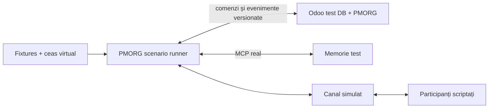

# PMORG — MVP de validare

| Câmp | Valoare |
|---|---|
| Status | Aprobat — canonic (2026-07-16) |
| Versiune | 0.1 |
| Data | 2026-07-16 |
| Scop | Validarea produsului Odoo–memorie înaintea integrării Hermes |
| Baseline | Odoo 19 Community + `project` + `hr` |

## 1. Întrebarea MVP-ului

> Putem conduce complet, într-un mediu sintetic, o inițiativă de la cerere
> până la rezultat verificat folosind starea reală din Odoo și memoria reală
> prin MCP, în timp ce orchestrarea, timpul, agentul și canalul sunt simulate
> determinist?

MVP-ul validează modelul produsului și contractele dintre componente. Nu
validează încă adecvarea Hermes, canalele reale, autonomia în producție sau
scalarea.

## 2. Principiul de construcție

```text
runner determinist + timp virtual + canal simulat
                         ↓ contracte finale
aplicația Odoo PMORG reală ↔ memoria reală prin MCP
```

„Real” înseamnă implementare cu intenție de producție: modele persistente,
migrări, permisiuni, validări, audit și API-uri versionate. Înseamnă scope
funcțional restrâns, nu produs complet sau autorizare pentru producție.

Runnerul, agentul scriptat și adaptorul de canal simulat sunt înlocuibile.
Scenariile și testele lor rămân suita de acceptanță pentru Hermes și pentru
adaptoarele de canal ulterioare.

## 3. Topologia MVP



Toate componentele folosesc instanțe, credențiale și date dedicate testului.
Nu există conexiune către Odoo, memorie, canale sau utilizatori de producție.

## 4. În scope

### 4.1 Odoo PMORG

- o aplicație instalabilă într-o bază Odoo curată de test;
- `pmorg.initiative`, obiectiv, criterii de succes și lifecycle minim;
- plan versionat în forma minimă necesară scenariului;
- extensia `project.task` pentru taskuri umane, agentice și hibride;
- rezultat așteptat, participanți, ancore, termen și dovadă;
- starea business separată de starea de orchestrare;
- starea minimă pentru `next_check_at`, răspuns așteptat și verificare;
- evenimente append-only și referințe către memorie;
- comenzi server-side validate și auditate;
- UI minim pentru inițiativă, Kanban, task, timeline și rezultat.

### 4.2 Ontologie și ancore

Prima felie obligatorie include:

- Project: `project.project`, `project.task`;
- Employees: `hr.employee`, `hr.department`, relația managerială;
- conceptele PMORG core: inițiativă, obiectiv, rezultat și dovadă.

Inventory și Time Off intră în scenariul longitudinal următor, nu sunt
condiții pentru smoke test. Fiecare pack trebuie să poată demonstra că:

1. se activează numai dacă modulul și schema cerute există;
2. extrage numai entitățile de prim nivel declarate;
3. respectă permisiunile;
4. refuză fail-closed o schemă incompatibilă;
5. nu copiază automat toate înregistrările în memorie.

### 4.3 Memorie reală prin MCP

Se reutilizează și se extinde nucleul `aipm`; adaptorul MVP expune un contract
MCP versionat. Suprafața minimă este:

```text
memory_recall
memory_capture_evidence
memory_propose_claim
memory_validate_claim
memory_get_timeline
memory_supersede
memory_record_outcome
```

Testul trebuie să folosească persistența și validarea reale, nu un dicționar
in-memory. Un fake al contractului este permis numai în testele unitare.

### 4.4 Runner determinist

Runnerul poate:

- lista obiectele scadente;
- revendica și elibera un task;
- aplica un pas de scenariu;
- avansa ceasul virtual;
- livra și primi mesaje simulate;
- injecta duplicate, întârzieri și indisponibilități;
- simula oprirea și repornirea procesului;
- depune evidență, bloca și finaliza un run;
- cere validarea rezultatului.

Runnerul nu conține reguli de business ascunse. Politicile și tranzițiile
aparțin Odoo; runnerul este un client al contractului de orchestrare.

### 4.5 Canal simulat

Transportul este simulat, dar conversația este reală ca model:

- identitatea expeditorului este structurală;
- fiecare mesaj are ID extern, correlation ID și idempotency key;
- mesajele sunt legate de participant, inițiativă și task;
- evidența intră în memoria reală;
- Odoo păstrează starea conversației și referințele necesare.

## 5. În afara scope-ului

- integrarea Hermes;
- un LLM real în testul determinist;
- Telegram, Teams, email sau alte canale live;
- utilizatori ori date reale;
- detectarea generală autonomă a inițiativelor;
- anchor packs pentru toate modulele Odoo;
- maparea automată a modulelor custom necunoscute;
- multi-company și multi-tenant la scară;
- optimizări de performanță;
- fine-tuning;
- pilot sau go-live.

## 6. Contractul minim al orchestratorului

Runnerul și viitorul adaptor Hermes trebuie să consume aceeași suprafață:

```text
list_due_work(filters, now)
claim_task(task_id, actor, capabilities, idempotency_key)
heartbeat(task_id, run_id, lease_token, expected_version)
release_task(...)
record_progress(...)
record_waiting_response(...)
schedule_next_check(...)
record_evidence_reference(...)
block_task(...)
complete_run(...)
propose_task(...)
propose_plan_version(...)
record_confirmation(...)
request_approval(...)
request_outcome_verification(...)
execute_authorized_command(...)
```

Fiecare mutație cere actor, companie, correlation/causation ID,
`idempotency_key` și versiunea așteptată. Contractul final se îngheață înainte
de implementarea runnerului complet.

## 7. Datele inițiale sintetice

### 7.1 Organizația

Companie: **Delta Distribution Test SRL**.

| Identitate sintetică | Rol | Autoritate relevantă |
|---|---|---|
| Mara Ionescu | owner | obiectiv și închidere |
| Andrei Pop | manager operațional | plan și replanificare |
| Mihai Stan | gestionar | informații despre incident |
| PMORG Test Agent | agent service | acțiuni delegate de test |

Structura managerială și identitățile de canal sunt fixtures, nu persoane
reale.

### 7.2 Obiectele

- proiect: `Clarificări operaționale — TEST`;
- inițiativă: `XNX-001 — clarifică diferența raportată`;
- obiectiv: stabilirea cauzei și a acțiunii necesare;
- criteriu: concluzie confirmată și task operațional cu dovadă;
- task agentic: `Discută cu gestionarul despre incidentul XNX-001`;
- task uman rezultat: `Aplică acțiunea confirmată pentru XNX-001`;
- raport sintetic de verificare: `TEST-EVID-XNX-001`, cu hash fix și autor
  distinct de autorul afirmației;
- Andrei Pop este validatorul sintetic autorizat de politica fixture-ului;
- un rezultat sintetic legat de raport și de criteriul de succes.

### 7.3 Conversația scriptată

Mesajul participantului:

> „Am găsit două cutii lăsate separat și nu am actualizat situația în
> sistem.”

Afirmația este mai întâi evidență, apoi claim candidat. Andrei o poate valida
numai după atașarea raportului independent `TEST-EVID-XNX-001`. Autorul
afirmației nu își poate valida singur claim-ul. Fixture-urile negative includ
un raport cu hash greșit și o validare cerută de un actor fără autoritate.

## 8. Smoke scenario

1. Mara creează manual inițiativa în Odoo.
2. Obiectivul și criteriul de succes sunt înregistrate.
3. PMORG creează taskul agentic de clarificare.
4. Runnerul revendică taskul atomic.
5. Canalul simulat livrează întrebarea și răspunsul scriptat.
6. Răspunsul intră ca evidență în memoria reală.
7. Este propus un claim legat de inițiativă, task și angajat.
8. Raportul sintetic independent este atașat, iar validatorul autorizat
   confirmă claim-ul; încercările cu actor sau dovadă greșite sunt refuzate.
9. PMORG creează taskul operațional rezultat.
10. Taskul este finalizat cu o dovadă sintetică distinctă.
11. Criteriul este verificat de politica fixture-ului și inițiativa se închide.
12. Timeline-ul reconstruiește lanțul complet.

Traseul validat este:

```text
inițiativă → task → conversație → evidență → claim validat
→ acțiune formală → dovadă → rezultat verificat
```

## 9. Criterii de acceptare pentru smoke test

MVP-ul smoke este acceptat numai dacă:

1. aplicația se instalează într-o bază de test curată;
2. datele sintetice se încarcă repetabil;
3. taskul este un `project.task` real și este legat de inițiativă;
4. doi clienți concurenți nu pot revendica același task;
5. retry-ul unei comenzi nu produce un al doilea efect;
6. mesajul are identitate și corelare structurală;
7. evidența persistă în memoria reală;
8. claim-ul rămâne candidat până la validare;
9. validarea este refuzată pentru actor neautorizat sau dovadă cu hash greșit;
10. obiectul formal rezultat este creat în Odoo;
11. închiderea este refuzată fără criteriu, dovadă suficientă și validatorul
    cerut de politică;
12. starea poate fi reconstruită după restartul runnerului;
13. auditul explică actorul, autoritatea, evidența, comanda și efectul;
14. niciun endpoint, credential sau record de producție nu este folosit.

## 10. Calificarea longitudinală post-MVP

Această etapă este obligatorie înaintea integrării Hermes, dar nu face parte
din Definition of Done al MVP-ului v0.1. După acceptarea smoke testului,
același dataset se extinde incremental cu:

1. lipsă de răspuns și un singur follow-up;
2. răspuns duplicat;
3. claim contradictoriu și rezolvare explicită;
4. modificare manuală concurentă în Odoo;
5. restart în starea `waiting_response`;
6. indisponibilitate temporară a memoriei;
7. anchor pack Inventory și verificarea unei mișcări sintetice;
8. anchor pack Time Off și replanificare la o absență sintetică;
9. escaladare conform unei politici;
10. supersession al unei decizii și închidere după rezultat verificat.

Fiecare element devine test separat înainte de combinarea într-un scenariu de
30–60 de zile simulate.

## 11. Teste și injecții de defecte

- unitare: modele, constrângeri, tranziții, politici, anchor packs;
- contract: Odoo API, MCP, canal și orchestrator;
- integrare: Odoo ↔ memorie;
- scenariu: smoke și extensiile longitudinale;
- negative: acces refuzat, schemă incompatibilă, versiune veche, lease
  expirat, dovadă lipsă, mesaj necorelat;
- recovery: restart, duplicate, timeout și serviciu indisponibil.

Ceasul virtual și seed-ul pseudo-aleator sunt fixe. Un eșec trebuie să poată
fi reprodus prin aceeași comandă și același fixture.

## 12. Gate-uri

### Gate A — contract și schemă

Modelele, stările și contractele sunt versionate; addon-ul se instalează;
fixture-urile sunt repetabile.

### Gate B — memorie reală

Persistența, proveniența, validarea și supersession trec prin MCP real.

### Gate C — smoke determinist

Scenariul complet trece folosind memoria reală, dar fără LLM, Hermes sau
canal real.

### Gate D — calificare longitudinală post-MVP

Restartul, tăcerea, duplicatele, contradicția și replanificarea trec cu timp
virtual.

### Gate E — AI în mediul de test

Un model real este evaluat pe aceleași fixtures; outputul său nu poate ocoli
validările deterministe.

### Gate F — adaptor Hermes

Hermes înlocuiește runnerul și trece aceeași suită. Numai după acest gate se
discută un adaptor de canal într-un mediu de test separat și, ulterior, un
pilot izolat, explicit non-production. Producția nu este folosită pentru
testarea niciunei etape.

## 13. Definition of Done

MVP-ul v0.1 este terminat când Gate-urile A–C sunt verzi, documentația și
fixture-urile sunt versionate, toate componentele pot fi pornite într-un
mediu izolat printr-o procedură repetabilă, iar raportul de test demonstrează
fără intervenție manuală traseul inițiativă–rezultat.

Gate D califică longitudinal arhitectura înaintea unui runtime real.
Gate-urile E și F sunt etapele ulterioare și nu blochează declararea MVP-ului
v0.1 al buclei de produs. PMORG nu poate fi descris drept „operator persistent
validat” înainte ca Gate D să fie verde.
