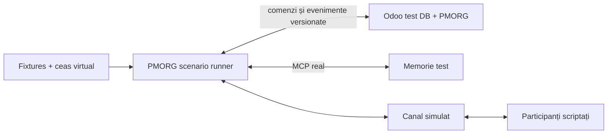

# PMORG — MVP de validare

| Câmp | Valoare |
|---|---|
| Status | Propunere canonică pentru revizuire |
| Versiune | 0.3 |
| Data | 2026-07-16 |
| Scop | Validarea produsului Odoo–memorie înaintea integrării Hermes |
| Baseline | Odoo 19 Community + `project`; `hr`/`stock` numai în profilurile care le activează |
| Revizie Odoo | `1b8f6802832cfa4d146193a912af1f4445d09f0a` |
| Mediu | [sandboxul complet de evaluare](06-EVALUATION-SANDBOX.md) |

## 1. Întrebarea MVP-ului

> Putem conduce complet, într-un mediu sintetic, o inițiativă de la cerere
> până la rezultat verificat folosind starea reală din Odoo și memoria reală
> prin MCP, în timp ce orchestrarea, timpul, agentul și canalul sunt simulate
> determinist, iar același build funcționează în organizații cu module și
> politici diferite?

MVP-ul validează modelul produsului și contractele dintre componente. Nu
validează încă adecvarea Hermes, canalele reale, autonomia în producție sau
scalarea.

Verdictul este valid numai dacă PMORG nu vede adevărul privat sau expected
outputs. Topologia completă, oracle-ul, run bundle-ul, corpusul și scorerul
sunt definite în `06-EVALUATION-SANDBOX.md`; diagrama de mai jos arată numai
fluxul funcțional, nu toate frontierele de securitate.

## 2. Principiul de construcție

```text
runner determinist + timp virtual + canal simulat
                         ↓ contracte finale
aplicația Odoo PMORG reală ↔ memoria reală prin MCP
```

„Real” înseamnă implementare cu intenție de producție: modele persistente,
migrări, permisiuni, validări, audit și API-uri versionate. Înseamnă scope
funcțional restrâns, nu produs complet sau autorizare pentru producție.

Runnerul, agentul scriptat și adaptorul de canal simulat sunt înlocuibile.
Scenariile și testele lor rămân suita de acceptanță pentru Hermes și pentru
adaptoarele de canal ulterioare.

## 3. Topologia MVP



Stiva se pornește independent pentru fiecare profil organizațional. Fiecare
profil are bază Odoo, namespace de memorie, credențiale și date dedicate
testului; nu se testează cele trei organizații ca firme într-o bază
multi-company comună. Nu există conexiune către Odoo, memorie, canale sau
utilizatori de producție.

Fixture-urile publice, oracle-ul privat și corpusul sunt depozite diferite.
Runnerul determinist este harness de referință la Gate C–D, nu inteligența
operatorului creditată de verdict. Manifestul declară `sut_scope` pentru ca
fiecare gate să spună fără ambiguitate ce componentă măsoară.

## 4. În scope

### 4.1 Odoo PMORG

- o aplicație instalabilă într-o bază Odoo curată de test;
- un `pmorg_core` dependent numai de `base` și `project`;
- `pmorg.identity` drept referință unică pentru owneri, validatori,
  participanți și agentul de test;
- `pmorg.initiative`, obiectiv, criterii de succes și lifecycle minim;
- plan versionat în forma minimă necesară scenariului;
- extensia `project.task` pentru taskuri umane, agentice și hibride;
- rezultat așteptat, participanți, ancore, termen și dovadă;
- starea business separată de starea de orchestrare;
- starea minimă pentru `next_check_at`, răspuns așteptat și verificare;
- evenimente append-only și referințe către memorie;
- comenzi server-side validate și auditate;
- UI minim pentru inițiativă, Kanban, task, timeline și rezultat.

### 4.2 Ontologie și ancore

Nucleul obligatoriu include Project (`project.project`, `project.task`) și
conceptele PMORG: inițiativă, obiectiv, rezultat și dovadă. El folosește
identități și ancore generice și trebuie să se instaleze fără `hr`, `stock`
sau Time Off.

Suita de conformitate adaugă selectiv:

- Employees prin `pmorg_anchor_hr`: `hr.employee`, `hr.department`, relația
  managerială, numai în profilurile distribuție și servicii;
- Inventory prin `pmorg_anchor_inventory`, numai în profilul distribuție:
  `INVENTORY_TRANSFER` peste `stock.picking` și `INVENTORY_MOVE` peste
  `stock.move`, cu relația move `part_of` transfer;
- teste explicite de absență pentru HR, Inventory și Time Off în profilul
  minimal.

Time Off intră abia în calificarea longitudinală post-MVP. Fiecare pack
inclus trebuie să poată demonstra că:

1. se activează numai dacă modulul și schema cerute există;
2. extrage numai entitățile de prim nivel declarate;
3. respectă permisiunile;
4. refuză fail-closed o schemă incompatibilă;
5. nu copiază automat toate înregistrările în memorie.

### 4.3 Memorie reală prin MCP

Se reutilizează și se extinde nucleul `aipm`; adaptorul MVP expune un contract
MCP versionat. Suprafața minimă este:

```text
memory_negotiate_registry
memory_recall
memory_capture_evidence
memory_propose_claim
memory_validate_claim
memory_get_timeline
memory_supersede
memory_record_outcome
```

Testul trebuie să folosească persistența și validarea reale, nu un dicționar
in-memory. Un fake al contractului este permis numai în testele unitare.

Snapshotul `aipm` nu este încă adaptorul v2 și nu este sandbox-safe prin
configurația implicită. În imaginea de evaluare nu sunt permise URL/DB de
producție ca default, ingestul implicit activ sau un token generic comun.
Lipsa `run_id`, `profile_id`, Odoo instance UUID, namespace sau endpoint
allow-listed oprește serviciul înainte de rețea ori ingest.

Registry-ul de ancore expus memoriei este negociat per profil: minimal oferă
numai PMORG, Project și identitățile generice din `base`; servicii adaugă HR;
distribuție adaugă HR și Inventory. Un tip absent nu produce eroare de
inițializare, ancoră fantomă sau fallback semantic inventat.

Runnerul obține descriptorul prin `get_capability_registry(profile_id)` și
apelează `memory_negotiate_registry` înaintea scenariului. Testele fixează
versiunea, fingerprint-urile pack-urilor și hash-ul descriptorului; mismatch
de versiune, fingerprint sau tip este refuzat fail-closed.

### 4.4 Runner determinist

Runnerul poate:

- lista obiectele scadente;
- revendica și elibera un task;
- aplica un pas de scenariu;
- solicita tick-uri controllerului de run; nu modifică direct ceasul hostului;
- livra și primi mesaje simulate;
- injecta duplicate, întârzieri și indisponibilități;
- simula oprirea și repornirea procesului;
- depune evidență, bloca și finaliza un run;
- cere validarea rezultatului.

Runnerul nu conține reguli de business ascunse. Politicile și tranzițiile
aparțin Odoo; runnerul este un client al contractului de orchestrare.

### 4.5 Canal simulat

Transportul este simulat, dar conversația este reală ca model:

- identitatea expeditorului este structurală;
- fiecare mesaj are ID extern, correlation ID și idempotency key;
- mesajele sunt legate de participant, inițiativă și task;
- evidența intră în memoria reală;
- Odoo păstrează starea conversației și referințele necesare.

## 5. În afara scope-ului

- integrarea Hermes;
- un LLM real în testul determinist;
- Telegram, Teams, email sau alte canale live;
- utilizatori ori date reale;
- detectarea generală autonomă a inițiativelor;
- anchor packs pentru toate modulele Odoo;
- maparea automată a modulelor custom necunoscute;
- multi-company și multi-tenant la scară;
- optimizări de performanță;
- fine-tuning;
- pilot sau go-live.

## 6. Contractul minim al orchestratorului

Runnerul și viitorul adaptor Hermes trebuie să consume aceeași suprafață:

```text
get_capability_registry(profile_id)
list_due_work(filters, tick_id)
claim_task(task_id, actor, capabilities, idempotency_key)
heartbeat(task_id, run_id, lease_token, expected_version)
release_task(...)
record_progress(...)
record_waiting_response(...)
schedule_next_check(...)
record_evidence_reference(...)
block_task(...)
complete_run(...)
propose_task(...)
propose_plan_version(...)
record_confirmation(...)
request_approval(...)
request_outcome_verification(...)
execute_authorized_command(...)
```

Fiecare mutație cere actor, companie, correlation/causation ID,
`idempotency_key` și versiunea așteptată. Contractul final se îngheață înainte
de implementarea runnerului complet.

`tick_id` este o capabilitate emisă de ceasul trusted pentru run; runtime-ul
nu o poate crea sau avansa. Odoo și memoria rezolvă server-side timpul
efectiv. Un `now`/`occurred_at` declarat liber de client nu este autoritativ
pentru termene, lease-uri ori ordine temporală.

## 7. Profilurile și datele sintetice

Un **profil** este un manifest versionat de module, anchor packs, politici și
fixture-uri. El include `odoo_revision`, identificatorul buildului PMORG și
checksum-urile artefactelor. Nu este variantă de produs. Fiecare profil
pornește într-o bază Odoo și într-un namespace de memorie separate, din
același commit și același set de artefacte PMORG. Setul livrat conține nucleul
și pack-urile opționale; manifestul profilului selectează ce instalează, fără
a produce un build nou.

### 7.1 Matricea organizațională

| ID | Organizație sintetică | Module/pack-uri | Politică distinctivă | Scenariu |
|---|---|---|---|---|
| `ORG-DIST` | Delta Distribution Test SRL | `project`, `hr`, `stock`; HR + Inventory | follow-up cu risc redus delegat; mutația de stoc cere aprobare | diferență de stoc XNX |
| `ORG-SERV` | Lumina Advisory Test SRL | `project`, `hr`; HR | angajamentele externe cer aprobare | livrabil întârziat |
| `ORG-MIN` | Atelier Minimal Test SRL | `project`; fără pack de domeniu | clarificare delegată; efectele business cer aprobare | criteriu de acceptare neclar |

Aceeași distribuție de cod este instalată fără patch, fork, feature flag cu
numele profilului sau manifest alternativ pentru `pmorg_core`.

### 7.2 Identități și autoritate

| Profil | Owner | Validator autorizat | Participant | Ancorare suplimentară |
|---|---|---|---|---|
| `ORG-DIST` | Mara Ionescu | Andrei Pop | Mihai Stan | identitățile sunt legate de angajați prin pack-ul HR |
| `ORG-SERV` | Ioana Pavel | Radu Ene | Teodora Marin | identitățile sunt legate de angajați prin pack-ul HR |
| `ORG-MIN` | Ana Dobre | Paul Rusu | Victor Neagu | numai `pmorg.identity`, fără `hr.employee` |

Fiecare persoană și `PMORG Test Agent` au câte un `pmorg.identity` cu
`partner_id`; `user_id` există numai dacă fixture-ul trebuie să acționeze în
Odoo. Pack-ul HR atașează `hr.employee` aceleiași identități prin utilizator
sau work contact și nu creează identități paralele. Autoritatea nu depinde
obligatoriu de ierarhia HR: nucleul poate folosi ownerul inițiativei, project
managerul și politica explicită. Niciun autor al unei afirmații nu o poate
valida singur.

### 7.3 Obiectele și conversațiile

| Profil | Inițiativă | Subiect ancorat | Task de clarificare | Dovadă independentă |
|---|---|---|---|---|
| `ORG-DIST` | `XNX-001 — clarifică diferența raportată` | `stock.picking` real și `stock.move` legat | discută cu gestionarul despre XNX | `TEST-EVID-DIST-001` |
| `ORG-SERV` | `SRV-001 — clarifică întârzierea livrabilului` | proiect și task de livrare | clarifică noul termen cu responsabilul | `TEST-EVID-SERV-001` |
| `ORG-MIN` | `MIN-001 — clarifică criteriul de acceptare` | proiect și task | obține criteriul lipsă de la participant | `TEST-EVID-MIN-001` |

Răspunsurile scriptate sunt, respectiv: două cutii nu au fost actualizate în
sistem; livrabilul necesită o clarificare și termenul nu mai este realist;
schița este terminată, dar lipsește confirmarea criteriului de acceptare.
Fiecare răspuns este întâi evidență și apoi claim candidat. Fiecare raport are
conținut și hash fix, autor distinct și validator autorizat. Fixture-urile
negative includ hash greșit, actor neautorizat și auto-validare.

## 8. Smoke scenario parametrizat

Același scenariu se execută pentru fiecare profil:

1. ownerul creează manual inițiativa în Odoo;
2. obiectivul și criteriul de succes sunt înregistrate;
3. PMORG creează taskul agentic de clarificare;
4. runnerul revendică taskul atomic;
5. canalul simulat livrează întrebarea și răspunsul profilului;
6. răspunsul intră ca evidență în memoria reală;
7. este propus un claim legat de inițiativă, task, participant și ancorele
   disponibile în profil;
8. dovada independentă este atașată, iar validatorul autorizat confirmă
   claim-ul; actorul sau dovada greșite sunt refuzate;
9. PMORG creează taskul operațional rezultat;
10. taskul este finalizat cu o dovadă sintetică distinctă;
11. criteriul este verificat de politica profilului și inițiativa se închide;
12. timeline-ul reconstruiește lanțul complet.

Traseul comun este:

```text
inițiativă → task → conversație → evidență → claim validat
→ acțiune formală → dovadă → rezultat verificat
```

În distribuție, registry-ul include HR și Inventory și XNX este ancorat în
fixture-ul `stock`. În servicii, HR este disponibil, dar Inventory și Time
Off nu sunt. În profilul minimal, numai PMORG, Project și identitățile
generice sunt disponibile; accesarea HR, Inventory sau Time Off este refuzată
determinist, fără ancore fantomă.

## 9. Criterii de acceptare pentru smoke și conformitate

MVP-ul smoke este acceptat numai dacă:

1. același commit PMORG, revizia Odoo
   `1b8f6802832cfa4d146193a912af1f4445d09f0a`, set de versiuni și listă de checksum-uri este folosit în trei
   baze curate, fără recompilare sau diferență de cod între profiluri;
2. `pmorg_core` se instalează și funcționează cu `project`, fără `hr`, `stock`
   sau Time Off;
3. pack-urile HR și Inventory se activează numai în profilurile declarate și
   refuză fail-closed o schemă incompatibilă; HR leagă `hr.employee` de
   `pmorg.identity` fără duplicare, iar XNX este legat prin `res_id` de
   `stock.picking` și `stock.move` reale, ale căror stări sunt citite live;
4. datele sintetice ale fiecărui profil se încarcă repetabil;
5. scenariul complet inițiativă–rezultat trece în toate cele trei profiluri;
6. taskul este un `project.task` real și este legat de inițiativă;
7. doi clienți concurenți nu pot revendica același task;
8. retry-ul unei comenzi nu produce un al doilea efect;
9. mesajul are identitate și corelare structurală;
10. evidența persistă în memoria reală izolată a profilului;
11. handshake-ul MCP acceptă descriptorul corect, refuză versiunea ori
    fingerprint-ul greșit și nu expune tipuri din module absente;
12. claim-ul rămâne candidat până la validare;
13. validarea este refuzată pentru actor neautorizat, auto-validare sau
    dovadă cu hash greșit;
14. obiectul formal rezultat este creat în Odoo;
15. închiderea este refuzată fără criteriu, dovadă suficientă și validatorul
    cerut de politică;
16. starea poate fi reconstruită după restartul runnerului;
17. auditul explică actorul, autoritatea, evidența, comanda și efectul;
18. niciun endpoint, credential sau record de producție nu este folosit.

## 10. Calificarea longitudinală post-MVP

Această etapă este obligatorie înaintea integrării Hermes, dar nu face parte
din Definition of Done al MVP-ului v0.1. După acceptarea smoke testului,
cele trei profiluri se extind incremental cu:

1. lipsă de răspuns și un singur follow-up;
2. răspuns duplicat;
3. claim contradictoriu și rezolvare explicită;
4. modificare manuală concurentă în Odoo;
5. restart în starea `waiting_response`;
6. indisponibilitate temporară a memoriei;
7. anchor pack Time Off și replanificare la o absență sintetică în profilul
   servicii;
8. arhivarea sau dispariția unei ancore în timpul inițiativei;
9. escaladare conform unei politici;
10. supersession al unei decizii și închidere după rezultat verificat.

Fiecare element devine test separat înainte de combinarea într-un scenariu de
30–60 de zile simulate.

## 11. Teste și injecții de defecte

- unitare: modele, constrângeri, tranziții, politici, anchor packs;
- contract: Odoo API, MCP, canal și orchestrator;
- integrare: Odoo ↔ memorie;
- matrice: același build și scenariu pe cele trei profiluri izolate;
- scenariu: smoke parametrizat și extensiile longitudinale;
- negative: acces refuzat, schemă incompatibilă, versiune veche, lease
  expirat, registry mismatch, identitate ambiguă, dovadă lipsă, mesaj
  necorelat;
- recovery: restart, duplicate, timeout și serviciu indisponibil.
- harness: probe anti-leak către oracle, canary, hash chain, trasă incompletă
  și controale intenționat defecte ale scorerului;
- metamorfice: redenumirea organizației, date irelevante, alt epoch virtual
  și reordonarea duplicatelor nu schimbă verdictul semantic.

Ceasul virtual și seed-ul pseudo-aleator sunt fixe. Un eșec trebuie să poată
fi reprodus prin aceeași comandă și același fixture.

## 12. Gate-uri

### Gate A — contract și schemă

Modelele, stările și contractele sunt versionate; `pmorg_core` se instalează
în profilul minimal, iar pack-urile opționale declară dependențe separate;
fixture-urile sunt repetabile. Kernelul minim de evaluare dovedește manifestul
imuabil, baze curate, oracle inaccesibil SUT, trasă append-only și reset prin
distrugerea volumelor. Un Odoo izolat cu date demo, inclusiv substratul S0
curent, nu este singur suficient pentru Gate A.

### Gate B — memorie reală

Persistența, proveniența, validarea și supersession trec prin MCP real, iar
registry-ul de ancore reflectă exact capabilitățile fiecărui profil.

`B-min` pe profilul minimal este numai milestone de integrare. Gate B este
complet când aceeași suită este rerulată pe toate profilele intrate în C2;
profilul distribuție trebuie să treacă înainte de C1, iar matricea
minimal/services/distribution înainte de C2. Un pack sau profil adăugat
redeschide automat Gate B pentru acel registry.

### Gate C1 — smoke determinist

Scenariul complet trece în profilul de referință distribuție folosind memoria
reală, dar fără LLM, Hermes sau canal real.

### Gate C2 — agnosticism organizațional

Același commit PMORG, aceeași revizie Odoo și aceleași artefacte trec
scenariul comun în profilurile distribuție, servicii și minimal, în baze și
namespace-uri de memorie separate. Diferă numai manifestul de
module/pack-uri, politicile și datele. Modulele absente nu sunt interogate și
nu produc câmpuri, tipuri sau ancore fantomă.

### Gate D — calificare longitudinală post-MVP

Restartul, tăcerea, duplicatele, contradicția și replanificarea trec cu timp
virtual.

### Gate E — AI în mediul de test

- **E1:** modelul operator rulează cu participanți scriptați, pentru a izola
  calitatea lui de variația interlocutorului;
- **E2:** modelul operator rulează cu LLM personas limitate la adevărul lor
  privat;
- **E3:** replici și seed-uri predeclarate dau distribuția, intervalul de
  încredere și costul.

Outputul AI nu poate ocoli validările deterministe, iar un LLM judge nu
decide gate-uri structurale sau de siguranță.

### Gate F — adaptor Hermes

- **F1:** Hermes/adaptorul înlocuiește runnerul cu un agent determinist de
  referință și trece contractele și scenariile structurale;
- **F2:** Hermes rulează operatorul AI înghețat la Gate E și trece din nou
  E1–E3 fără schimbarea Odoo, MCP, scenariilor sau scorerului.

Numai după F2 se discută un adaptor de canal într-un mediu de test separat și,
ulterior, un pilot izolat, explicit non-production. Producția nu este folosită
pentru testarea niciunei etape.

## 13. Definition of Done

MVP-ul v0.1 este terminat când Gate-urile A, B, C1 și C2 sunt verzi,
documentația, manifestele de profil și fixture-urile sunt versionate, toate
componentele pot fi pornite în medii izolate printr-o procedură repetabilă,
iar raportul de test demonstrează fără intervenție manuală traseul
inițiativă–rezultat, izolarea oracle și identitatea buildului între profiluri.
Instrumentul care emite raportul trece Definition of Done din
`06-EVALUATION-SANDBOX.md`; un run invalid nu poate acorda MVP-ului `PASS`.

Gate D califică longitudinal arhitectura înaintea unui runtime real.
Gate-urile E și F sunt etapele ulterioare și nu blochează declararea MVP-ului
v0.1 al buclei de produs. PMORG nu poate fi descris drept „operator persistent
validat” doar pentru că MVP-ul este verde: Gate D este necesar pentru
longitudinalitate, Gate E pentru comportamentul operatorului AI, iar Gate F2
pentru produsul integrat pe runtime-ul Hermes ales. Până la toate trei,
afirmația trebuie limitată la capabilitatea/gate-ul demonstrat efectiv.
