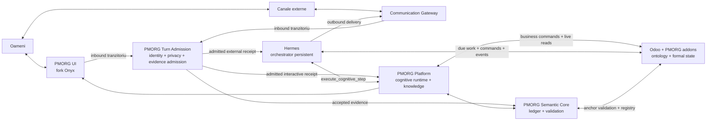

# PMORG v3 — arhitectura țintă

| Câmp | Valoare |
|---|---|
| Status | Accepted — requirements baseline `RB-1/C1` |
| Versiune | `3.0-baseline.2` |
| Data | 2026-07-18 |
| Natură | arhitectură țintă, nu descrierea implementării curente |

## 1. Decizia centrală

PMORG v3 este o platformă Odoo-first construită printr-un fork guvernat al
Onyx Community Edition.

- **Odoo** este ontologia executabilă, registrul muncii formale și control
  plane-ul efectelor organizaționale.
- **PMORG Platform** este workspace-ul utilizatorului și runtime-ul cognitiv;
  include capabilitățile Onyx și Semantic Core.
- **PMORG Semantic Core** este ledgerul organizațional pentru evidență,
  claims, validări, contradicții, supersession și istorie temporală.
- **Hermes** este orchestratorul persistent vizat pentru procese de zile sau
  luni; el nu deține canonic inițiativele ori taskurile.
- **Communication Gateway** verifică identități de canal, normalizează
  mesaje și gestionează livrarea.

Onyx și Hermes nu au același rol. Onyx-PMORG execută un pas cognitiv bounded;
Hermes decide când acel pas trebuie executat, îl reia, îl corelează și
continuă procesul longitudinal.

## 2. Topologia produsului



În MVP, runnerul determinist înlocuiește Hermes, iar canalul simulat
înlocuiește gateway-ul real. PMORG Platform, Odoo și Semantic Core sunt
implementări reale, cu contractele finale.

## 3. Bounded contexts și proprietatea datelor

| Domeniu | Proprietar canonic | Observație |
|---|---|---|
| companie, entități și stare business curentă | Odoo | se citesc live, nu din index |
| inițiativă, plan aprobat, task, termen, rezultat formal | Odoo + addon-urile PMORG | `project.task` rămâne registrul muncii organizaționale |
| gap de proveniență, materialitate și stare de remediere | Odoo + addon-urile PMORG | control-plane canonic; controllerul determinist rulează aici și compară efectele cu receipts din Semantic Core |
| identitate organizațională și autoritate operațională | Odoo/PMORG | Onyx și gateway păstrează numai bindings |
| registry de capabilități și anchor packs active | Odoo/PMORG | descriptor versionat și fingerprint-uit |
| evidență, claims și istoricul validării | Semantic Core | append-only unde este relevant |
| contradicții, supersession și valid time | Semantic Core | nu se reduc la taguri ori text |
| documente, chunks, embeddings și retrieval | Onyx knowledge/index | proiecție reconstruibilă |
| conversație și execuție cognitivă bounded | PMORG Platform | nu este starea longitudinală canonică |
| workflow, scheduling, retries și tool traces | Hermes | stare operațională de runtime, reconciliabilă |
| mesaj extern, delivery și sender verificat | Communication Gateway | transport, nu sens organizațional |
| oracle, personas, expected outputs și scorer | harness de evaluare | inaccesibile produsului |

Regula de consistență este:

> Odoo spune **ce este formal adevărat acum**; Semantic Core spune **ce s-a
> observat, de ce credem ceva și cum s-a schimbat**; PMORG Platform decide
> **ce pas cognitiv propune**; Hermes decide **când și cum continuă procesul**.

## 4. Structura internă a fork-ului

```text
PMORG Platform
├── Interaction & Operator Workspace
│   ├── chat, operator inbox și guvernanță vocabular/ancoră
│   ├── digest de gaps și rata de acoperire
│   └── context organizațional obligatoriu
├── Cognitive Runtime (derivat din Onyx)
│   ├── agent/model routing
│   ├── bounded execution și actions
│   └── knowledge/RAG
├── Organizational Semantic Core (PMORG)
│   ├── evidence și claim ledger
│   ├── authority/temporal/contradiction validation
│   └── recall și timeline
├── Odoo Capability Layer
│   ├── registry și anchor resolution
│   ├── live reads
│   └── authorized business commands
├── Orchestration Contract
│   └── runner determinist / adaptor Hermes
└── Communication Contract
    └── simulated gateway / adaptoare reale
```

Semantic Core este în același produs și repository cu Onyx-PMORG, dar are
modele, migrații, ownership și backup proprii. „Core în produs” nu înseamnă
„tabele amestecate în schema Onyx”.

## 5. Izolarea persistenței

Topologia minimă de date este:

| Store | Natură | Politică |
|---|---|---|
| Odoo PostgreSQL | autoritar | instanță/serviciu separat; backup propriu |
| Onyx application DB | aplicațional | utilizatori, chat, agent config și jobs |
| Semantic Ledger DB | autoritar semantic | DB/rol/migrații proprii; retenție și backup proprii |
| Search/vector store | derivat | poate fi reconstruit din surse și ledger |
| Object store | surse/evidence payloads | hash, retenție și ACL; ledgerul păstrează referințe |
| Evaluation Oracle DB | adevăr privat de test | rețea, credențiale și volum inaccesibile SUT |

Într-un MVP, Onyx DB și Semantic Ledger pot folosi același cluster
non-Odoo numai dacă sunt baze și roluri separate și testele demonstrează
izolarea. Odoo nu împarte clusterul scanabil cu bazele memoriei. Producția nu
conține oracle, ceas virtual, personas ori fault injector.

## 6. Contextul obligatoriu

Orice conversație, tool call, comandă sau operație semantică poartă un
`OrganizationContext` explicit:

```json
{
  "organization_id": "uuid",
  "odoo_instance_uuid": "uuid",
  "company_id": 1,
  "identity_id": "uuid",
  "profile_id": "ORG-DIST",
  "registry_version": "1.0",
  "registry_fingerprint": "sha256:...",
  "initiative_id": "odoo-id-or-null",
  "task_id": "odoo-id-or-null",
  "run_id": "uuid",
  "conversation_id": "uuid-or-null",
  "correlation_id": "uuid"
}
```

Câmpurile nullable sunt permise numai pentru operații care nu au încă acel
obiect. Lipsa organizației, instanței Odoo, companiei, identității sau
registry-ului oprește operația fail-closed.

Tenantul nu se deduce din text, hostname nesigur sau ultima conversație.

## 7. Odoo-first și closed world

Odoo publică un registry versionat:

```text
module instalat și configurat
∩ anchor pack compatibil și aprobat
∩ ACL/record rules ale identității
∩ companie și politici active
= univers operațional permis
```

Discovery-ul tehnic poate inspecta module, modele și câmpuri, dar numai
anchor pack-ul dă semnificație business. Un model custom necunoscut poate
genera o propunere de mapare; nu intră automat în registry.

O ancoră conține cel puțin:

```text
organization_id · odoo_instance_uuid · company_id · anchor_type
model · res_id · registry_version · schema_fingerprint
observed_write_date · relation_role
```

Rezoluția verifică existența live, compania, accesul, tipul permis și
compatibilitatea pack-ului. `res_id` și numele modelului, singure, nu sunt o
ancoră validă.

## 8. Contractul cognitiv

Hermes sau runnerul nu trimit prompturi libere într-o sesiune perpetuă. Ele
apelează un contract bounded:

```text
execute_cognitive_step(
  organization_context,
  objective,
  observed_state_version,
  allowed_actions,
  evidence_refs,
  policy_refs,
  idempotency_key
) -> CognitiveStepResult
```

Rezultatul conține:

```text
status · summary · evidence_captured · claim_proposals
business_command_proposals · messages_to_send
wait_condition · recommended_next_check · explanation
```

Rezultatul este propunere. Semantic Core validează claims, iar Odoo validează
și execută comenzile permise. Modelul nu poate adăuga singur actions,
anchor types ori autoritate.

## 9. Contractele Odoo

Suprafața externă este îngustă și versionată:

```text
get_capability_registry(context)
resolve_anchor(context, anchor_ref)
list_due_work(context, filters, tick_capability)
claim_task(context, task_id, expected_version, idempotency_key)
heartbeat(context, task_id, run_id, lease_token)
record_progress(...)
record_waiting_response(...)
schedule_next_check(...)
activate_due(...)
mark_managed(...)
record_followup(...)
record_escalation(...)
reclaim_expired(...)
record_provenance_gap(...)
resolve_provenance_gap(...)
propose_task(...)
propose_plan_version(...)
record_confirmation(...)
request_approval(...)
record_evidence_reference(...)
request_outcome_verification(...)
execute_authorized_command(...)
complete_run(...)
```

Fiecare mutație verifică actorul, compania, autonomia, tranziția, versiunea,
lease-ul și cheia de idempotency. Nu există ORM sau SQL generic pentru model,
Onyx ori Hermes.

Odoo folosește outbox tranzacțional și command inbox. Livrarea între sisteme
este at-least-once; consistența rezultă din idempotency, receipts,
reconciliere și compensări, nu dintr-o tranzacție distribuită imaginară.

## 10. Contractul Semantic Core și MCP

Codul PMORG din fork apelează un API de domeniu intern. Aceeași semantică este
expusă extern prin MCP standard pentru Hermes și alte integrări:

```text
negotiate_registry
capture_evidence
propose_claim
assess_claim
validate_claim
record_contradiction
supersede_claim
record_commitment
record_outcome
recall
get_timeline
```

MCP este o frontieră contractuală, nu obligă procesele din același backend să
facă loopback HTTP. Implementarea de evaluare trebuie să fie un server MCP
interoperabil, nu un JSON-RPC particular numit „MCP”.

## 11. Conversații și canale

Gateway-ul emite un `MessageEnvelope` cu:

```text
external_message_id · channel_id · verified_sender_principal
organization_id · identity_binding · conversation_id
correlation_id · content_ref · content_hash · received_at
```

Pentru inbound, `MessageEnvelope` este strict pre-admission și tranzitoriu.
Gateway-ul sau UI-ul invocă mai întâi intrarea `admit_message` a PMORG Turn
API. Ea face identity binding, privacy/secrets gate și, numai după acceptare,
captura durabilă de evidence. Abia apoi emite un `AdmittedMessage` fără
payload, `content_ref` sau `content_hash`. Pentru canal extern, Hermes/runnerul
primește numai acest receipt admis și continuă Turn API; pentru UI, același
receipt intră direct în pasul interactiv bounded. Gateway-ul nu pornește un al
doilea flux cognitiv paralel.

Identitatea vine structural din adaptor. Dacă binding-ul este absent sau
ambiguu, mesajul intră în reconciliere și nu produce efect organizațional.

După identity binding și înaintea oricărei persistențe PMORG, conținutul trece
printr-o poartă deterministă de intimitate și secrete. Bufferul raw poate
exista numai volatil în adaptor/Turn Admission: Hermes nu îl poate primi,
checkpoint-a, loga sau programa, iar Onyx nu îl poate transforma în transcript
ori prompt înaintea verdictului. La refuz, mesajul nu ajunge la Hermes,
runner sau runtime-ul cognitiv, iar PMORG nu
creează transcript Onyx, `SourceArtifact`, `Evidence`, chunk, embedding ori
content hash. Se păstrează numai un receipt minim fără conținut sau referință
la el: message ID, policy version, reason code și timpul recepției. Bufferul
tranzitoriu al adaptorului de intrare — gateway sau UI — este șters conform
politicii canalului.

În Onyx UI, utilizatorul are aceeași identitate PMORG și același context de
organizație. Transcriptul poate deveni evidență, dar nu este automat memorie
validată. Memoria personală Onyx este dezactivată pentru agenții PMORG până
când există o politică explicită care îi separă scope-ul de cel
organizațional.

## 12. Longitudinalitate

Controller-ele deterministe decid când există muncă:

| Controller | Determinist | AI bounded, dacă este necesar |
|---|---|---|
| Deadline | termen apropiat/depășit | formularea intervenției |
| Silence/Progress | lipsă progres peste prag | interpretarea contextului |
| Dependency | dependență blocată | alternative de plan |
| Commitment | confirmare/termen lipsă | interpretarea ambiguității |
| Conversation | timeout/răspuns așteptat | următoarea întrebare |
| Escalation | prag și politică | sinteză pentru decident |
| Completion | criterii și dovezi mecanice | suficiența semantică |
| Initiative | sănătatea agregată | replanificare |
| Provenance Gap | efect material fără cauză, angajament fără închidere, referință-fantomă ori inițiativă fără urmă | formularea unei întrebări/digest, niciodată verdictul |

Controllerul citește starea din Odoo și Semantic Core, execută cel mult un
pas idempotent, persistă efectul și programează `next_check_at`. Un runtime
nou poate continua de acolo.

### 12.1 Detectorul golului de proveniență

`pmorg.provenance.gap` este stare canonică în Odoo. Controllerul detectorului
rulează în addon-ul/control-plane-ul PMORG din Odoo, nu în Semantic Core și nu
în model. Query-urile sale deterministe compară tracking/events/materiality
registry din Odoo cu evidence, bindings și receipts citite din Semantic Core
prin API-ul de domeniu îngust:

| Clasă | Semnal determinist |
|---|---|
| `D1` | câmp material schimbat fără evidence/claim ancorat în fereastra politicii |
| `D2` | commitment formal rezolvat ori contrazis fără conversație/evidence de închidere |
| `D3` | referință de tip „cum am stabilit” cu recall negativ pe ancora indicată |
| `D4` | tranziții ale inițiativei fără evenimente conversaționale corelate |
| `D5` | absență conversațională agregată; niciodată dosar individual |

Un gap este o suspiciune, nu un verdict despre o persoană. Răspunsul intră ca
mesaj nou prin Turn Coordinator; interpretarea rămâne automată. Omul intervine
numai dacă explicația expune o entitate recurentă, un tip nou de ancoră sau un
matching de ancoră ambiguu cu consecință.

Onyx-PMORG proiectează un digest bounded, gaps după vechime/materialitate și
rata de acoperire:

```text
schimbări materiale cu proveniență consemnată / total schimbări materiale
```

UI-ul nu oferă butoane pentru etichetarea kind/owner/termen/semantică. Poate
deschide conversația de clarificare și workspace-ul separat de guvernanță a
vocabularului/ancorei.

## 13. Moduri degradate

| Eșec | Comportament obligatoriu |
|---|---|
| Odoo indisponibil | fără validare de adevăr curent și fără mutații; contextul istoric este etichetat stale |
| Semantic Core indisponibil | regulile pur mecanice pot continua; pașii care cer memorie intră `memory_pending` |
| Onyx cognitive runtime indisponibil | taskurile și timers rămân în Odoo; pașii cognitivi sunt reprogramați |
| Hermes indisponibil | lease-urile expiră; backlogul rămâne vizibil și operabil manual |
| gateway/canal indisponibil | delivery pending și retry; fallback numai autorizat |
| registry incompatibil | tipul/pack-ul este dezactivat fail-closed |
| răspuns necorelat | coadă de reconciliere; fără atașare prin presupunere |
| rezultat tardiv după lease | respins sau trimis la review |

Odoo UI rămâne fallback-ul manual. O pauză de urgență oprește execuția
agentică fără să blocheze operarea umană în ERP.

## 14. Observabilitate

Toate componentele propagă `organization_id`, `initiative_id`, `task_id`,
`run_id`, `conversation_id`, `correlation_id`, `causation_id`,
`registry_fingerprint`, `memory_reference_id` și ID-urile mesajelor.

Pentru fiecare efect trebuie să putem răspunde: cine a acționat, sub ce
autoritate, ce stare și dovezi a văzut, ce model/configurație a rulat, ce
comandă a propus, ce validare a permis-o, ce s-a schimbat și ce urmează.
