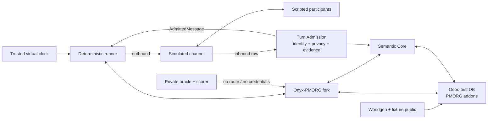

# PMORG v3 — MVP de validare

| Câmp | Valoare |
|---|---|
| Status | Accepted — requirements baseline `RB-1/C2` |
| Versiune | `3.0-baseline.3` |
| Data | 2026-07-19 |
| Orchestrare | runner determinist pe contractul final; fără orchestrator extern în MVP |
| Comunicare | canal simulat pe contractul final |
| Date | exclusiv sintetice, în sandbox separat de producție |

## 1. Întrebarea MVP-ului

> Poate PMORG v3 conduce și relua în timp o inițiativă de la cerere la rezultat
> verificat, folosind un fork Onyx-PMORG real, Odoo real și Semantic Core real,
> cu closed world, memorie validată și efecte idempotente, în trei organizații
> sintetice diferite, în timp ce orchestrarea și canalul sunt simulate
> determinist?

MVP-ul validează arhitectura produsului și longitudinalitatea structurală. Nu
validează încă un orchestrator extern, un canal real, cererea comercială, comportamentul unui
model pe distribuția reală ori operarea în producție.

## 2. Principiul de construcție

```text
runner determinist + timp virtual + canal simulat
                         ↓ contracte finale
fork Onyx-PMORG real ↔ Semantic Core real ↔ Odoo PMORG real
```

„Real” înseamnă cod cu lifecycle de producție: modele persistente, migrări,
autorizare, audit, contracte versionate și moduri degradate. Scope-ul este
restrâns, dar componentele centrale nu sunt mock-uri de aruncat.

Un fake este permis în teste unitare. Niciun gate de integrare nu poate folosi
un dicționar in-memory drept Semantic Core sau un JSON fixture drept Odoo.

## 3. SUT și topologia



SUT-ul MVP include fork-ul Onyx-PMORG, Semantic Core, Odoo/addon-urile PMORG,
runnerul și canalul simulat. Oracle-ul, expected outputs, personas private și
scorerul sunt harness, nu produs.

Fiecare profil pornește cu volume, baze, roluri, namespace-uri, secrete și
rețele dedicate. Niciun serviciu nu are default către producție.

## 4. Scope funcțional

### 4.1 Fork Onyx-PMORG

- build reproducibil dintr-un tag și SHA Onyx fixat;
- PMORG Turn API și `OrganizationContext` obligatoriu;
- identity binding Onyx user → `pmorg.identity`;
- Turn Coordinator imposibil de ocolit în distribuția PMORG;
- chat/turn persistence și knowledge retrieval de bază;
- guvernanță minimă exclusiv pentru vocabular/ancoră, separată de claims;
- digest read-only pentru gaps de proveniență și rata de acoperire;
- tool preflight înaintea oricărei comenzi Odoo;
- memoria personală generică dezactivată pentru agentul PMORG;
- `onyx_surface` și `usage_mode` declarate separat; `ce` conține zero cod
  Enterprise, orice suprafață `ee` are inventar complet, `ee + development_test`
  blochează tehnic producția/distribuirea, iar `ee + production` cere dovadă
  validă de autorizare pentru entitate și seats/scope.

### 4.2 Odoo PMORG

- `pmorg_core` instalabil cu `base` și `project`, fără `hr` ori `stock`;
- `pmorg.identity`, inițiativă, obiectiv, criteriu și plan versionat minim;
- `project.task` extins pentru muncă human/agent/hybrid/monitor;
- stare business separată de orchestration state;
- `next_check_at`, wait condition, lease, state version și idempotency;
- comandă system-only `activate_due` pentru reactivarea deterministă a
  wait/schedule pe eveniment corelat ori timp trusted;
- outcome, evidence reference, approval și verification;
- capability registry și schema fingerprint;
- anchor packs HR și Inventory opționale;
- `pmorg.provenance.gap`, materiality registry și controllerul determinist D1
  executat în addon/control-plane; D2–D5 se activează fazat prin profil;
- comenzi înguste, outbox/inbox și audit;
- UI minim Odoo pentru fallback și inspectarea stării formale.

### 4.3 Semantic Core

- baze și migrații proprii;
- `Evidence`, `Claim`, assessments, validation, contradiction și supersession;
- proveniență, autoritate, valid time și recorded time;
- registry negotiation și ancore cu instance/company/fingerprint;
- recall, timeline și query `as_of`;
- API intern plus server MCP standard;
- index/proiecție reconstruibilă fără pierderea ledgerului;
- query-uri și receipts de evidence/binding/proveniență consumate de
  controllerul D1 din Odoo, fără ownership asupra lifecycle-ului gap-ului.

### 4.4 Runner și canal simulat

- consumă aceleași contracte ca orchestratorul și gateway-ul viitor;
- listează și revendică atomic munca scadentă;
- avansează numai prin `tick_id` emis de ceasul trusted;
- livrează și primește mesaje cu identitate structurală;
- injectează duplicate, întârzieri, restart și indisponibilități;
- nu conține reguli business ascunse;
- emite o trasă completă și un run bundle imuabil.

## 5. Ce nu intră în MVP

- adaptorul unui orchestrator extern (Hermes rămâne candidat);
- Telegram, Teams, Slack, email sau alt canal real;
- date ori utilizatori reali;
- LLM personas;
- autonomie în producție;
- anchor packs pentru toate modulele Odoo;
- multi-tenant la scară și optimizări de performanță;
- fine-tuning;
- importul datelor v1/v2;
- pilot sau go-live.

Un model real poate fi introdus într-un gate ulterior pe aceeași suită. MVP-ul
nu are nevoie de output stochastic pentru a demonstra proprietățile
structurale.

## 6. Datele sintetice inițiale

Același build rulează în trei baze curate. Fixture-urile și expected outputs
sunt înghețate în
[profilurile organizaționale de conformitate](13-ORGANIZATION-PROFILES.md):

| Profil | Module și packs | Inițiativă | Politică distinctivă |
|---|---|---|---|
| `ORG-MIN` | Project; fără HR/Inventory | criteriu de acceptare neclar | efectele business cer aprobare |
| `ORG-SERV` | Project + Employees; HR pack | livrabil întârziat | angajamentele externe cer validare distinctă |
| `ORG-DIST` | Project + Employees + Inventory; HR + Inventory packs | diferență de stoc XNX | clarificarea este delegată; mutația de stoc cere aprobare |

Fiecare profil conține:

- companie și instanță Odoo distincte;
- owner, participant, verificator business al outcome-ului și agent de test;
- identity bindings complete și cazuri negative ambigue;
- proiect, inițiativă, task și criteriu;
- cel puțin o conversație ambiguă;
- evidence independentă cu hash cunoscut;
- o contradicție și un supersession;
- politică de monitorizare și autonomie;
- adevăr privat în oracle, inaccesibil SUT.

Worldgen materializează obiectele publice prin ORM/API Odoo; nu menține un
JSON paralel pe care produsul să-l citească.

## 7. Vertical slice M0

M0 demonstrează integrarea de bază, dar nu este încă MVP-ul:

1. ownerul creează o inițiativă în Odoo;
2. Odoo publică un task de clarificare prin outbox;
3. runnerul revendică atomic taskul;
4. participantul simulat primește întrebarea și răspunde;
5. mesajul trece prin identity + privacy gate și devine evidence durabilă;
6. extractorul determinist produce un claim candidat;
7. Semantic Core rezolvă ancora live și aplică validarea;
8. policy engine-ul autorizat validează automat claim-ul; persoana nu
   adnotează interpretarea;
9. runnerul propune un task operațional prin comanda controlată;
10. Odoo creează taskul și receipt-ul fără efect duplicat;
11. rezultatul primește dovadă și verificare;
12. inițiativa se închide, iar timeline-ul reconstruiește lanțul complet.

Traseul este:

```text
inițiativă → task → conversație → evidence → claim validat
→ comandă autorizată → task formal → dovadă → rezultat verificat
```

## 8. Scenariul longitudinal obligatoriu

Într-un run curat separat, aceeași familie de fixture și inițiativă este
executată pe 30–60 de zile virtuale. M0 și longitudinalul nu împart o
inițiativă live: fiecare începe din volume curate și se închide o singură
dată. Varianta longitudinală include:

1. lipsă de răspuns și follow-up conform politicii;
2. mesaj și comandă duplicate;
3. restart Onyx-PMORG în `waiting_response`;
4. restart runner și recuperarea lease-ului expirat;
5. răspuns întârziat corelat cu conversația și taskul corect;
6. claim contradictoriu păstrat ca `disputed`, cu efectele blocking refuzate;
7. decizie nouă care supersedează fără să șteargă istoricul;
8. modificare concurentă în Odoo și optimistic conflict;
9. indisponibilitate temporară Semantic Core și reluare din `memory_pending`;
10. indisponibilitate Odoo, fără ancore ori efecte pretins curente;
11. replanificare și escaladare;
12. verificare și închiderea rezultatului după restart complet al stackului.
13. o schimbare materială fără evidence în fereastră produce exact un gap D1,
    iar explicația ulterioară îl închide printr-un nou turn guvernat.

## 9. Gate-uri

Identificatorii canonici ai suitei v3 au prefixul `G3-`. Astfel `G3-D`
înseamnă vertical slice-ul v3, iar `V2-GD` în documentele frozen
înseamnă calificarea longitudinală istorică din
`docs/pmorg-v2/09-GATE-D-REPORT.md`; nu sunt același gate.

### G3-A — fork și build reproducibil

- tagul și SHA-ul Onyx, commitul PMORG, imaginile și SBOM-ul sunt fixate;
- suita upstream trece înainte și după integrare;
- artefactul respectă matricea declarată: `ce` fără cod Enterprise; orice
  suprafață `ee` cu inventar complet; `ee + development_test` cu production
  guard; `ee + production` numai cu autorizare validă și verificabilă;
- bazele pornesc curate și migrările sunt repetabile;
- patch ledger-ul acoperă toate modificările upstream.

### G3-B — Odoo control plane și closed world

- profilul minimal se instalează fără HR/Inventory;
- registry-ul reflectă exact modulele și pack-urile active;
- ancorele verifică instanță, companie, model, record, ACL și versiune;
- comanda generică ORM/SQL nu există;
- claim, lease, idempotency și outbox/inbox trec testele concurente.

### G3-C — Semantic Core real

- evidence, claims, autoritate, timp, contradiction și supersession persistă;
- auto-validarea, hash-ul greșit și registry mismatch sunt refuzate;
- privacy gate refuză înainte de transcript/evidence/index și nu păstrează
  conținut, content reference sau hash;
- query-urile `as_of` disting valid time de recorded time;
- ștergerea search indexului nu afectează ledgerul, iar rebuildul este complet;
- serverul expune MCP interoperabil, nu un protocol particular cu aceeași
  etichetă.

### G3-D — vertical slice M0

Scenariul complet trece în `ORG-DIST`, fără LLM, orchestrator extern sau canal real, iar
auditul leagă inițiativa de rezultat.

### G3-E — agnosticism organizațional

Același commit, aceleași imagini și checksum-uri trec scenariul comun în
`ORG-MIN`, `ORG-SERV` și `ORG-DIST`. Diferă numai manifestul, modulele,
pack-urile, politicile și datele. Tipurile absente nu apar ca ancore, actions,
formalizări sau controale UI tipizate. Ele pot apărea numai ca text brut ori
`external_mention` etichetat necanonic în evidence/recall.

### G3-F — longitudinalitate și recovery

Scenariul din §8, concretizat în
[`XNX-LONG`](10-XNX-REFERENCE-SCENARIO.md), trece cu timp virtual și
restarturi. Nicio obligație nu se pierde și niciun efect nu se dublează.
Detectorul D1 păstrează exact-once lifecycle-ul gap-ului și calculează rata de
acoperire contra oracle-ului sintetic.

### G3-G — operator AI

După MVP:

- G3-G1: modelul rulează cu participanți scriptați;
- G3-G2: modelul rulează cu personas limitate la adevărul lor privat;
- G3-G3: replici și seed-uri predeclarate raportează distribuție, cost și
  intervale de încredere.

Outputul modelului nu poate ocoli G3-B/G3-C.

### G3-H — orchestrator extern (Hermes candidat)

- G3-H1: adaptorul selectat înlocuiește runnerul ca executor determinist al contractului;
- G3-H2: orchestratorul selectat rulează operatorul înghețat la G3-G fără
  schimbarea Odoo,
  Semantic Core, scenariilor sau scorerului.

### G3-I — canal real în test

Un singur adaptor de canal se califică într-un mediu dedicat, cu identități și
conturi de test. Abia după G3-I se poate defini un pilot izolat,
non-production.

## 10. Definition of Done

MVP-ul v3 este terminat când G3-A–G3-F sunt verzi și un raport generat
automat dovedește:

1. identitatea exactă a buildului și a fixture-urilor;
2. separarea SUT de oracle și absența oricărui endpoint de producție;
3. același build în cele trei profiluri;
4. traseul complet inițiativă–rezultat;
5. continuarea după restart și timp virtual;
6. refuzurile closed-world, authority și cross-tenant;
7. inexistența efectelor duplicate;
8. persistența ledgerului după reconstruirea indexului;
9. auditul complet și artefactele de reproducere.

M0 poate fi prezentat numai ca „vertical slice structural”. După G3-A–G3-F
putem spune „persistență structurală validată cu runner determinist”. Numai
după G3-G și G3-H2 putem descrie produsul integrat drept operator AI persistent
validat în sandbox. Niciuna dintre aceste formulări nu autorizează producția.
