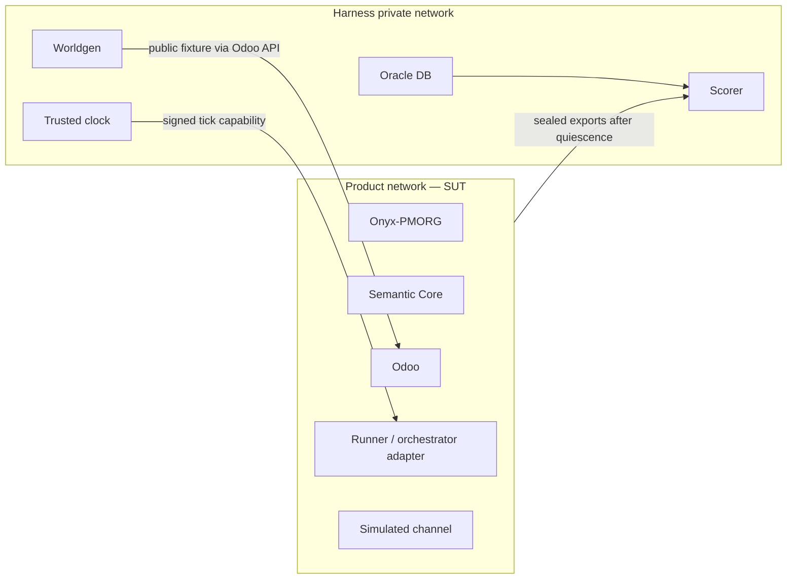

# PMORG v3 — evaluare și date sintetice

| Câmp | Valoare |
|---|---|
| Status | Accepted — requirements baseline `RB-1/C2` |
| Versiune | `3.0-baseline.3` |
| Data | 2026-07-19 |
| Lege | zero teste în producție |

## 1. Ce trebuie demonstrat

Evaluarea nu întreabă dacă PMORG produce o conversație convingătoare. Ea
întreabă separat dacă:

1. starea și efectele formale sunt corecte;
2. memoria păstrează și recuperează adevărul disponibil fără a-l inventa;
3. operatorul clarifică, urmărește și închide bucla;
4. procesele supraviețuiesc timpului, restarturilor și defectelor;
5. același produs funcționează în organizații diferite;
6. modelul și orchestratorul nu ocolesc politicile deterministe.

## 2. Frontiera de securitate



SUT nu are rută, DNS, mount, secret, API sau credential către oracle și gold
labels. Scorerul rulează după quiescence/seal. O scurgere de oracle invalidează
rularea, indiferent de scor.

Oracle DB nu împarte serviciul PostgreSQL, rolul ori backupul cu Odoo, Onyx
sau Semantic Core.

## 3. Cele șase stări care nu se confundă

Scorarea păstrează separat:

```text
W(t) — adevărul lumii sintetice
O(t) — starea formală Odoo
K(p,t) — ce știe participantul p
E(t) — evidența efectiv livrată PMORG
A(t) — autoritatea valabilă
M(t) — memoria observată de PMORG
```

PMORG nu este penalizat pentru un adevăr privat care nu a intrat în `E(t)` și
nu este recompensat dacă îl ghicește. Expected memory devine activă numai
după evidența necesară și sub autoritatea corespunzătoare.

## 4. Worldgen

Worldgen are nucleu generic și domain packs:

```text
worldgen core
  organizații · identități · calendare · inițiative · proiecte · timp

domain packs
  project-minimal · professional-services · distribution · ...
```

Un pack declară modulele și anchor packs cerute, generatorii de obiecte și
evenimente, incidentele și invariantele de materializare. Worldgen packs
produc date de benchmark; anchor packs definesc semantica produsului.

Din `seed + profile + versions` rezultă un `world.lock` cu hash. Obiectele
publice sunt create prin Odoo ORM/API. Adevărul privat și expected outputs
rămân exclusiv în oracle.

Un incident descrie:

- momentul și actorii;
- adevărul integral;
- ce este vizibil formal în Odoo;
- ce știe fiecare participant;
- ce evidență poate fi dezvăluită și sub ce condiție;
- claims/contradicții/supersession așteptate;
- rezultat și criterii verificabile.

## 5. Participanții

Evaluarea folosește în această ordine:

1. **participanți scriptați**, determinist, pentru contracte și structură;
2. **operator AI cu participanți scriptați**, pentru izolarea modelului;
3. **LLM personas**, limitate la fișa și adevărul lor privat, pentru realism;
4. replici predeclarate pentru distribuție și intervale de încredere.

O persona nu poate interoga Odoo ori oracle în afara informației pe care ar
avea-o persoana jucată. Nu se clonează o persoană reală identificabilă.

## 6. Run bundle

Fiecare rulare fixează cel puțin:

```text
pmorg_product_version
pmorg_spec_commit
pmorg_platform_commit
onyx_upstream_tag_and_sha
onyx_surface + usage_mode
artifact_set_hash + image_lock_hash
build_qualification_manifest_hash + attestation_dsse_hash
qualification_bundle_index_hash + evidence_bundle_index_hashes
ee_inventory_report_hash | ce_boundary_report_hash, după suprafață
deployment_payload_descriptor/fingerprint + target_descriptor/fingerprint
target_measurement_dsse_hash + deployment_admission_dsse_hash + use_receipts
distribution_payload/destination_descriptor_hashes
distribution_measurement/admission_dsse_hashes + transfer use_receipts
capability_catalog/disposition/evidence hashes
provenance_scan/evidence_bundle hashes
odoo_revision_and_image_digest
semantic_schema_version
contract_versions
organization_profile + module/pack fingerprints
world seed + world.lock
scenario + policy versions
clock/fault plan
model/provider/prompt/tool configuration, dacă există AI
image digests + SBOM
```

Manifestul public este vizibil SUT. Manifestul oracle este legat criptografic
de run, dar conținutul lui rămâne privat. Resetul distruge volumele și emite
credențiale noi.

Artefactele finale includ evenimentele append-only, sealed exports, logs
redactate, scorul, motivele de invalidare și checksums. Un scorer nou creează
un verdict nou; nu rescrie verdictul istoric.

## 7. Metrici

| Funcție | Măsură principală |
|---|---|
| evidence capture | precision/recall contra evenimentelor efectiv livrate |
| claim extraction | precision/recall și tip semantic corect |
| ancorare | exact match pe instance/company/type/model/record |
| authority | accept/refuz corect la momentul evaluat |
| temporalitate | acuratețe `as_of` pentru valid și recorded time |
| contradiction | rată de detecție și absența rezoluțiilor inventate |
| supersession | lanț corect fără pierderea istoricului |
| recall | must-retrieve, must-not-retrieve și citation/provenance |
| provenance gaps | precision/recall D1–D5, duplicate rate, time-to-explanation și rata de acoperire exactă |
| closed world | zero ancore/actions pentru tipurile absente |
| idempotency | zero efecte suplimentare la duplicate/retry |
| longitudinalitate | obligații recuperate, follow-up/escaladare la timp |
| outcome verification | zero închideri fără criterii/dovezi cerute |
| agnosticism | același build și aceleași scenarii de bază în trei profiluri |
| cost și latență | distribuție per pas/scenariu, fără a ascunde quality gates |

Un scor agregat nu poate ascunde eșecul unui caz `must`, al unui profil sau al
unei funcții de siguranță.

## 8. Teste structurale obligatorii

- cross-organization și cross-company access;
- registry/fingerprint mismatch;
- identity binding absent ori ambiguu;
- mesaj privacy/secret-denied: zero transcript, evidence, content ref/hash,
  index, prompt ori checkpoint/log/input orchestrator/runner; mesajul nu ajunge la
  runtime; numai receipt metadata-only;
- absența oricărui endpoint/action de review pentru interpretarea claim-ului;
- auto-validare și validator neautorizat;
- hash evidence greșit;
- prompt injection care cere un tool nepermis;
- record Odoo arhivat/șters ori modificat concurent;
- message, event și command duplicate;
- restart separat pentru Onyx, Semantic Core, Odoo și orchestrator;
- lease expirat și rezultat tardiv;
- indisponibilitate temporară a fiecărei componente;
- ștergere și rebuild al search indexului;
- încercare de acces la oracle/canary;
- telemetrie, update check și egress direct nepermis;
- efect material fără proveniență: gap D1 exact-once, digest și închidere prin
  evidence nouă;
- scenarii metamorfice: redenumirea organizației, date irelevante, alt epoch
  virtual și reordonarea duplicatelor nu schimbă verdictul semantic.

## 9. Corpus și fine-tuning

Corpusul canonic separă `train`, `calibration` și `hidden-test` la nivel de
familie de incident și lineage, nu per mesaj ori seed. Hidden labels sunt
accesibile numai scorerului.

Formatul poate produce ulterior exporturi de fine-tuning, dar:

- același incident și derivatele lui nu intră în train și hidden-test;
- pragurile se stabilesc pe calibration și se îngheață;
- conversațiile și datele reale nu sunt copiate automat;
- o eroare observată într-un pilot devine un caz sintetic sanitizat nou;
- decizia de fine-tuning nu este luată înaintea baseline-ului măsurabil.

## 10. Regula permanentă

> Orice eroare relevantă observată ulterior este reprodusă într-un sandbox
> sintetic, cu adevăr consemnat și test de regresie, înainte să fie considerată
> rezolvată.

Un eventual pilot este non-production, separat și aprobat. Producția nu este
folosită niciodată pentru descoperirea experimentală a comportamentului.
